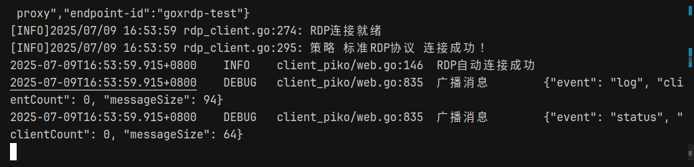
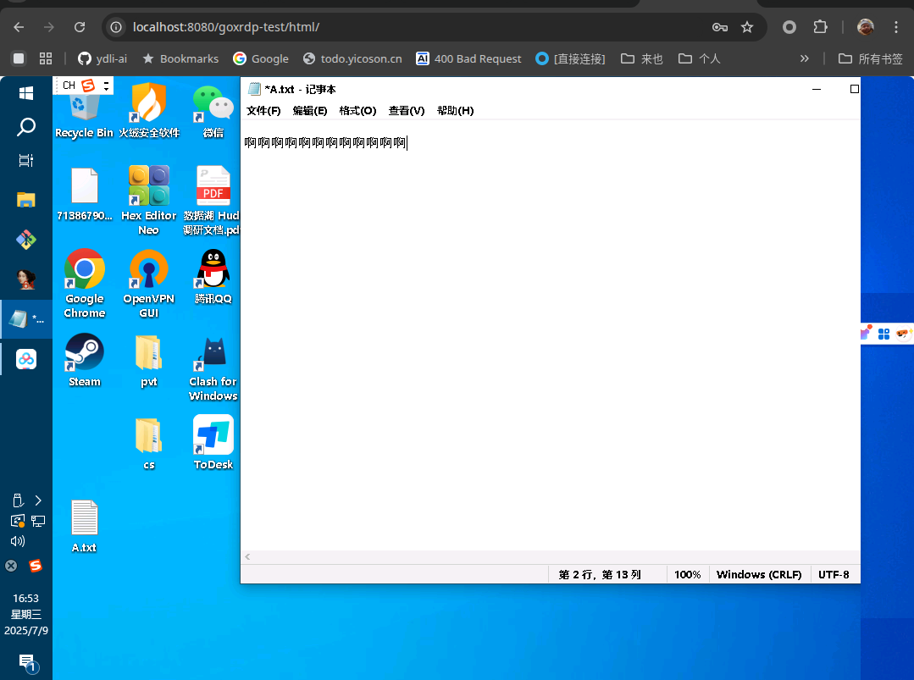

# grdp-piko

A Windows RDP remote desktop tool based on grdp protocol and piko network forwarding. Access and control Windows remote desktop through web browsers without complex network configuration and external network addresses.

[grdp](https://github.com/xxx/grdp) - Go language implementation of RDP protocol client
[piko](https://github.com/andydunstall/piko) - Lightweight network tunnel service

## Project Features

- 🖥️ **Web Remote Desktop**: Access Windows remote desktop through browser
- 🚀 **Lightweight**: Implemented in Go language with low resource consumption
- 🔧 **Simple Deployment**: Backend Docker one-click deployment with simple configuration
- 🔒 **Secure and Reliable**: Based on RDP protocol with user authentication support
- 📱 **Cross-platform**: Supports Linux, macOS, and Windows clients
- 🌐 **Network Penetration**: Achieves intranet penetration through piko service

## Architecture Overview

```
Windows RDP Server (Port 3389)
    ↓ RDP Protocol
grdp Client (goxrdp)
    ↓ piko Tunnel
piko Server
    ↓ HTTP/WebSocket
Web Browser
```

## Quick Start

### Server Deployment

1. **Deploy using Docker Compose**

```yaml
# docker-compose.yaml
version: "3.8"
services:
  piko:
    image: ghcr.io/friddle/grdp-piko-server:latest
    container_name: grdp-piko-server
    environment:
      - PIKO_UPSTREAM_PORT=8022
      - LISTEN_PORT=8088
    ports:
      - "8022:8022"
      - "8088:8088"
    restart: unless-stopped
```

Or use Docker directly:

```bash
docker run -ti --network=host --rm --name=piko-server ghcr.io/friddle/grdp-piko-server
```

2. **Start the service**

```bash
docker-compose up -d
```

### Client Usage

#### Linux Client

```bash
# Download client
wget https://github.com/friddle/grdp/releases/download/v1.0.0/goxrdp-linux-amd64 -O ./goxrdp
chmod +x ./goxrdp

# Basic connection
./goxrdp --name=windows-server --remote=192.168.1.100:8088

# Specify RDP server and user
./goxrdp --name=windows-server --remote=192.168.1.100:8088 \
  --xrdp-host=192.168.1.200 \
  --xrdp-user=Administrator \
  --xrdp-pass=password

# Disable auto-exit
./goxrdp --name=windows-server --remote=192.168.1.100:8088 --auto-exit=false
```





## Access Method

When the client starts, access the Windows remote desktop through the following address:
```
http://host-server-IP:port/client-name
```

For example:
- Server listening address: `192.168.1.100:8088`
- Client name: `windows-server`
- Access address: `http://192.168.1.100:8088/windows-server`

## Configuration

### Client Parameters

| Parameter | Description | Default | Required |
|-----------|-------------|---------|----------|
| `--name` | piko client identifier name | - | ✅ |
| `--remote` | Remote piko server address (format: host:port) | - | ✅ |
| `--xrdp-host` | Windows RDP server host address | Auto-detect local IP | ❌ |
| `--xrdp-port` | Windows RDP server port | 3389 | ❌ |
| `--xrdp-user` | Windows RDP username | Auto-detect current user | ❌ |
| `--xrdp-pass` | Windows RDP password | - | ❌ |
| `--xrdp-domain` | Windows RDP domain (empty for local computer name) | Auto-detect computer name | ❌ |
| `--auto-exit` | Enable 24-hour auto-exit | true | ❌ |

### Server Environment Variables

| Variable | Description | Default |
|----------|-------------|---------|
| `PIKO_UPSTREAM_PORT` | Piko upstream port | 8022 |
| `LISTEN_PORT` | HTTP listen port | 8088 |

### Use Cases

1. **Intranet Penetration**: Expose intranet Windows servers to external network through piko service
2. **Remote Assistance**: Remote control Windows desktop through web browser
3. **Development and Debugging**: Perform development and debugging in remote Windows environment
4. **Server Management**: Manage Windows servers through web interface

### Security Considerations

- Ensure RDP server has Network Level Authentication (NLA) enabled
- Use strong passwords to protect RDP accounts
- Consider using VPN or firewall to restrict access
- Regularly update Windows system and RDP service

### Troubleshooting

1. **Connection Failed**: Check if Windows RDP service is enabled (port 3389)
2. **Authentication Failed**: Confirm username and password are correct, check account permissions
3. **Network Issues**: Verify piko server address and port are correct
4. **Permission Issues**: Ensure client has sufficient network access permissions

## Technology Stack

- **Backend**: Go language
- **RDP Protocol**: grdp (Go RDP client)
- **Network Tunnel**: piko
- **Web Interface**: HTML5 Canvas + WebSocket
- **Deployment**: Docker

## License

This project is open source under the MIT License. 